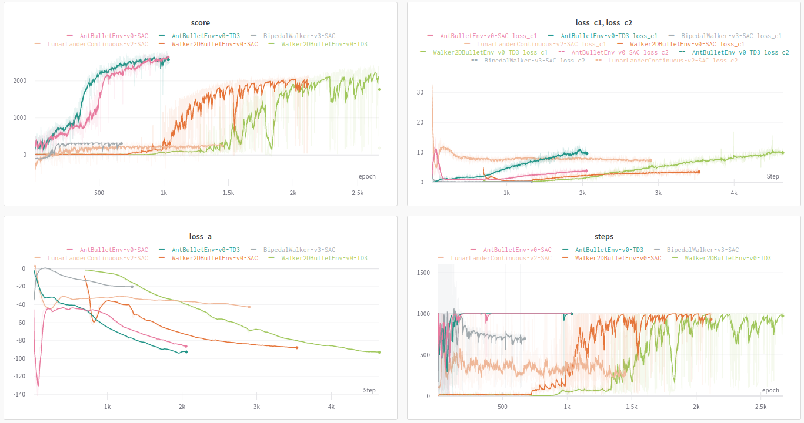

# RL Toolkit

[](https://github.com/markub3327/rl-toolkit/releases)

[](https://github.com/markub3327/rl-toolkit/issues)


## Papers
  * [**Soft Actor-Critic**](https://arxiv.org/abs/1812.05905)
  * [**Generalized State-Dependent Exploration**](https://arxiv.org/abs/2005.05719)
  * [**Reverb: A framework for experience replay**](https://arxiv.org/abs/2102.04736)
  * [**Controlling Overestimation Bias with Truncated Mixture of Continuous Distributional Quantile Critics**](https://arxiv.org/abs/2005.04269)

## Setting up container
```bash
# Preview
docker pull markub3327/rl-toolkit:latest

# Stable
docker pull markub3327/rl-toolkit:2.0.2
```

## Run
```bash
# Run learner's container
docker run -p 8000:8000 -it --rm markub3327/rl-toolkit

# Run tester's or agent's container
docker run -it --rm markub3327/rl-toolkit


# Learner container
python3 -m rl_toolkit -e [ENV_NAME] learner --db_server [IP_ADDRESS/HOSTNAME] -s [PATH_TO_MODEL] [--wandb] [-h]

# Agent container
python3 -m rl_toolkit -e [ENV_NAME] agent --db_server [IP_ADDRESS/HOSTNAME] [--wandb] [-h]

# Tester container
python3 -m rl_toolkit -e [ENV_NAME] tester --model_path [PATH_TO_MODEL] [--render] [--wandb] [-h]

# Server container
python3 -m rl_toolkit -e [ENV_NAME] server --db_path [PATH_TO_DB] [-h]
```

## Tested environments

  | Environment              | Observation space | Observation bounds | Action space | Action bounds |
  | ------------------------ | :---------------: | :----------------: | :----------: | :-----------: |
  | BipedalWalkerHardcore-v3 | (24, ) | [-inf, inf] | (4, ) | [-1.0, 1.0] |
  | Walker2DBulletEnv-v0     | (22, ) | [-inf, inf] | (6, ) | [-1.0, 1.0] |
  | AntBulletEnv-v0          | (28, ) | [-inf, inf] | (8, ) | [-1.0, 1.0] |
  | HalfCheetahBulletEnv-v0  | (26, ) | [-inf, inf] | (6, ) | [-1.0, 1.0] |
  | HopperBulletEnv-v0       | (15, ) | [-inf, inf] | (3, ) | [-1.0, 1.0] |
  | HumanoidBulletEnv-v0     | (44, ) | [-inf, inf] | (17, ) | [-1.0, 1.0] |
  | MinitaurBulletEnv-v0     | (28, ) | [-167.72488, 167.72488] | (8, ) | [-1.0, 1.0] |

## Results

<p align="center"><b>Summary</b></p>
<p align="center">
  <a href="https://wandb.ai/markub/rl-toolkit?workspace=user-markub" target="_blank"></a>
</p>

<p align="center"><b>Score</b></p>

  | Environment              | SAC + gSDE | SAC + gSDE<br>+ Huber loss | TQC + gSDE | TQC + gSDE<br>+ Reverb |
  | ------------------------ | :--------: | :------------------------: | :--------: | :---------------------------: |
  | BipedalWalkerHardcore-v3 | 13 ± 18[<sup>(2)</sup>](https://sb3-contrib.readthedocs.io/en/stable/modules/tqc.html#results) | - | 228 ± 18[<sup>(2)</sup>](https://sb3-contrib.readthedocs.io/en/stable/modules/tqc.html#results) | - |
  | Walker2DBulletEnv-v0     | 2270 ± 28[<sup>(1)</sup>](https://paperswithcode.com/paper/generalized-state-dependent-exploration-for) | **2732 ± 96** | 2535 ± 94[<sup>(2)</sup>](https://sb3-contrib.readthedocs.io/en/stable/modules/tqc.html#results) | - |
  | AntBulletEnv-v0          | 3106 ± 61[<sup>(1)</sup>](https://paperswithcode.com/paper/generalized-state-dependent-exploration-for) | **3460 ± 119** | 3700 ± 37[<sup>(2)</sup>](https://sb3-contrib.readthedocs.io/en/stable/modules/tqc.html#results) | - |
  | HalfCheetahBulletEnv-v0  | 2945 ± 95[<sup>(1)</sup>](https://paperswithcode.com/paper/generalized-state-dependent-exploration-for) | **3003 ± 226** | 3041 ± 157[<sup>(2)</sup>](https://sb3-contrib.readthedocs.io/en/stable/modules/tqc.html#results) | - |
  | HopperBulletEnv-v0       | 2515 ± 50[<sup>(1)</sup>](https://paperswithcode.com/paper/generalized-state-dependent-exploration-for) | **2555 ± 405** | 2401 ± 62[<sup>(2)</sup>](https://sb3-contrib.readthedocs.io/en/stable/modules/tqc.html#results) | - |
  | HumanoidBulletEnv-v0 | - | - | - | - |
  | MinitaurBulletEnv-v0 | - | - | - | - |

## Model

<p align="center">
  
</p>

----------------------------------

**Frameworks:** Tensorflow, Reverb, OpenAI Gym, PyBullet, WanDB, OpenCV
