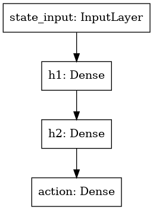
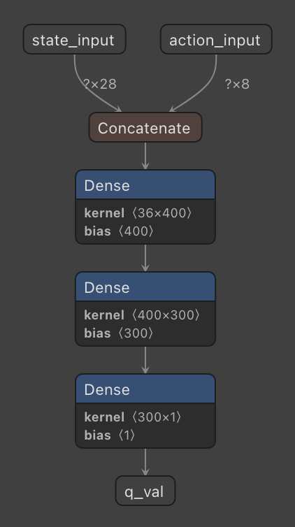
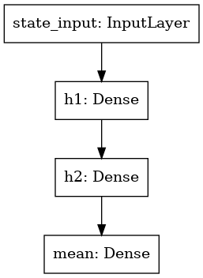
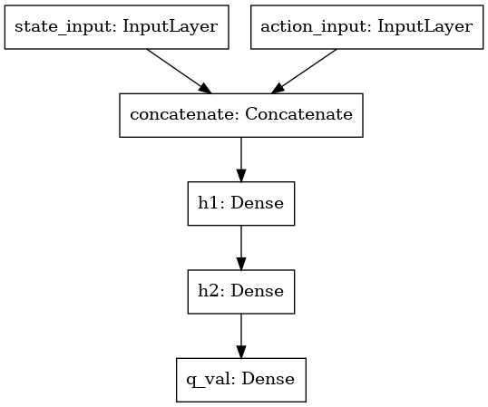

# RL toolkit

[](https://github.com/markub3327/rl-toolkit/releases)


[](https://github.com/markub3327/rl-toolkit/issues)


## Papers

  * **Soft Actor-Critic** (https://arxiv.org/pdf/1812.05905.pdf)
  * **Twin Delayed DDPG** (https://arxiv.org/pdf/1802.09477.pdf)
  * **Generalized State-Dependent Exploration** (https://arxiv.org/pdf/2005.05719.pdf)

## Setting up container

#### YOU MUST HAVE INSTALL DOCKER !!!

```shell
# 1. Build the Docker image
./build.sh

# 2. Run the container's shell
./run.sh

# if scripts are cannot be runned please use before
chmod +x build.sh
```

## Using

```shell
# Run learner instance
python3 rl-learner.py [-h] -env ENV_NAME -s PATH_TO_MODEL_FOLDER [--wandb]

# Run agent (worker) instance
python3 rl-agent.py [-h] -env ENV_NAME -f PATH_TO_MODEL_FOLDER [--wandb]
```

## Topology

<p align="center"><b>Actor (Twin Delayed DDPG)</b></p>
<p align="center">
  
</p>

<p align="center"><b>Critic (Twin Delayed DDPG)</b></p>
<p align="center">
  
</p>

<p align="center"><b>Actor (Soft Actor-Critic) - Netron</b></p>
<p align="center">
  
</p>

<p align="center"><b>Critic (Soft Actor-Critic) - Netron</b></p>
<p align="center">
  
</p>

## Tested environments
  
  * MountainCarContinuous-v0
  * BipedalWalker-v3
  * BipedalWalkerHardcore-v3
  * LunarLanderContinuous-v2
  * Walker2DBulletEnv-v0
  * AntBulletEnv-v0

<p align="center"><b>Summary</b></p>
<p align="center">
  
</p>
<p align="center"><a href="https://wandb.ai/markub/rl-toolkit/" target="_blank">For more charts click here.</a></p>


----------------------------------

**Framework:** Tensorflow 2.4.0
<br>
**Languages:** Python 3.8
<br>
**Database**: MongoDB 4.4.2 Community (Rapsberry Pi 4, Ubuntu Server 20.04 LTS)
<br>
**Storage**: NFS server (Rapsberry Pi 4, Ubuntu Server 20.04 LTS)
<br>
**Author**: Martin Kubovcik
